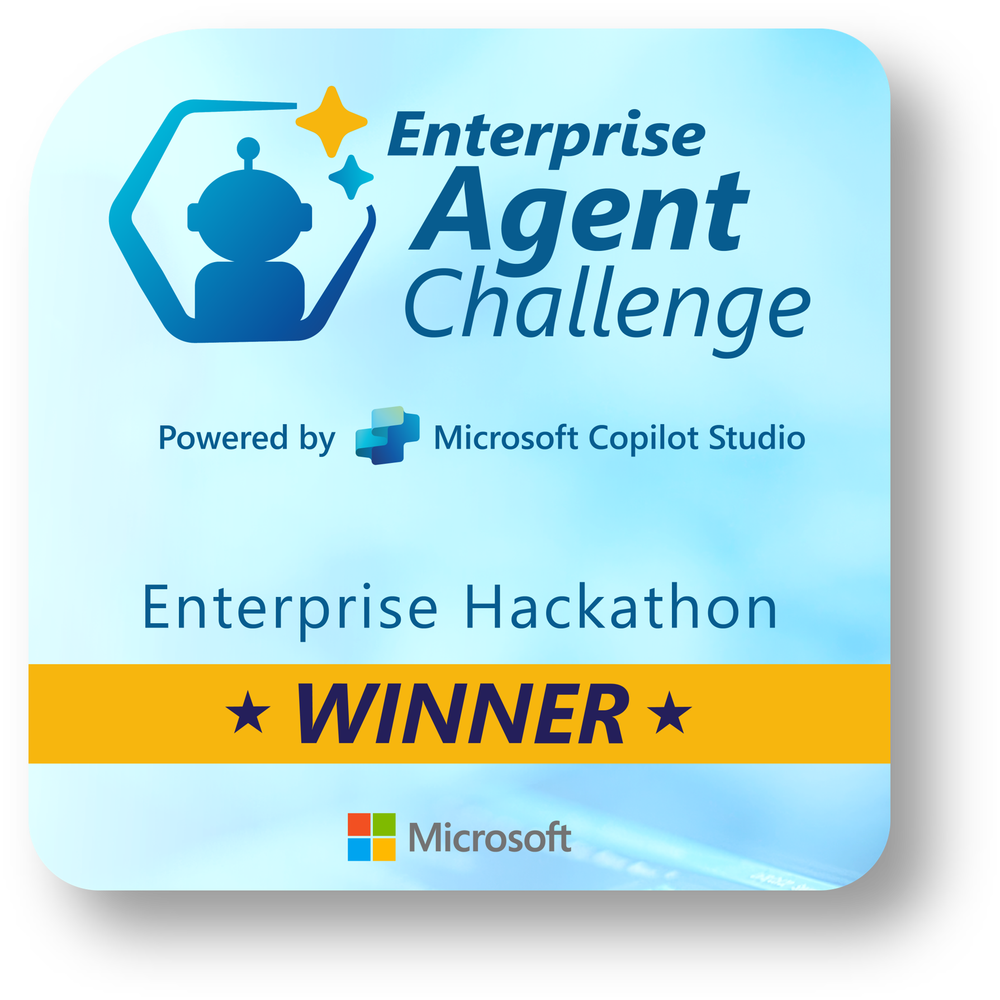

## Olá pessoal! Sou Alexsander Maia Simas 😎👋

- 👨‍💻 Hoje trabalho como analista de dados da Bulbe energia.
- 🕵️‍♂️ Pós Graduando em IA para Dev´s (FIAP) 
- ✔️ MBA em Business Inteligence 📈
- 🌱 Foco em Deep Learning e IA
- 📡 Projetos pessoais em Machine Learning
- 📊 Dashboard utilizando Power BI
  
- 🤖 **Projeto de Agente de IA usando Copilot studio da Microsoft (entre os 8 melhores projetos do mundo), EAC-chalenge da microsoft.**

  

  <a href="https://github.com/alexmaiasimas07">
  
  

  

 
  <h2 align"center"><u>Softwares/Linguagens que utilizo</u></h2>
  
  
  
  

  <h3 align"center"><u>Pacotes que utilizo</u></h3>
  
  
  
  
  
  
  
  
  
 

  <h3 align="center"><u>Redes Sociais</u></h3>
  
  

   
